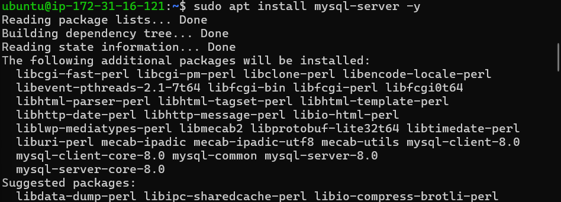
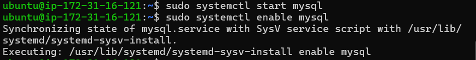
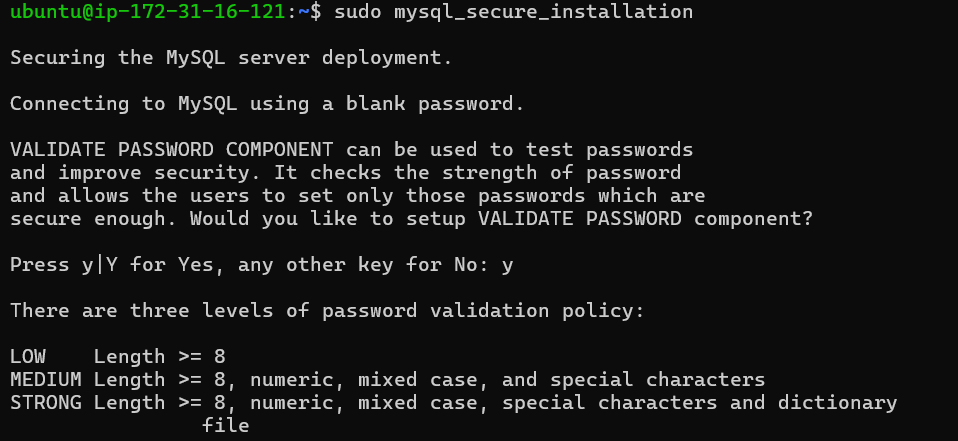
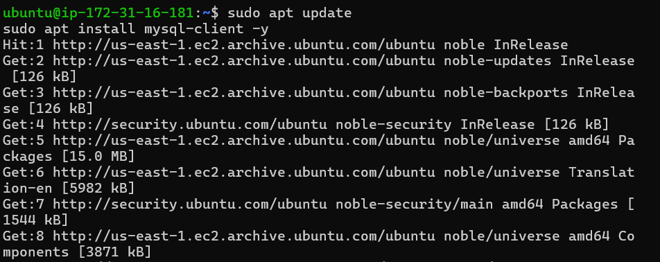
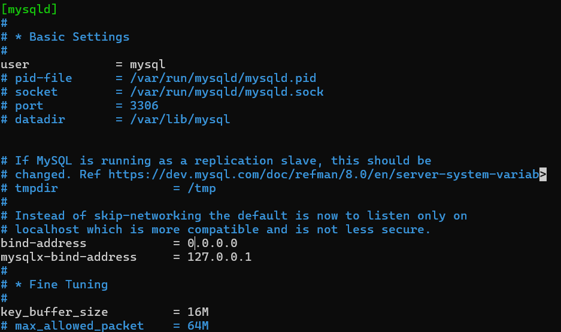
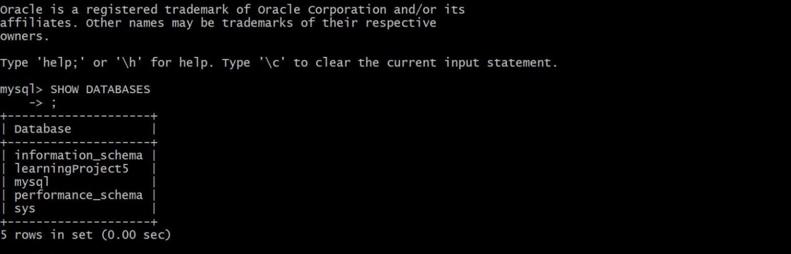

# CLIENT-SERVER ARCHITECTURE USING MYSQL DBMS

## 📌 Project Overview

This project demonstrates deploying a **Client-Server Architecture** using **MySQL Relational Database Management System (RDBMS)** on **AWS EC2 Ubuntu Servers**.

The components used:

* **MySQL Server** → Relational database management system (RDBMS)
* **MySQL Client** → Command-line client to connect and interact with the server

The project setup allows you to:

* 🖥 Connect remotely from a client to the MySQL server
* 💾 Create, read, update, and delete databases and tables
* 📊 Practice basic SQL queries (`SHOW DATABASES`, `CREATE`, `SELECT`, etc.)

---

## ☁️ AWS Environment Setup

### Step 0 — Preparing Prerequisites

* Two EC2 instances running **Ubuntu Server 24.04 LTS**
  * Server A → `mysql server`
  * Server B → `mysql client`
* Instance type: `t2.micro` (or similar)
* Ensure both instances are in the same **VPC/local network** for communication


Connect to your EC2 instance:

```bash
ssh -i <Your-private-key.pem> ubuntu@<EC2-Public-IP>
````

Update Ubuntu:

```bash
sudo apt update
sudo apt upgrade -y
```

---

#  Step 1 — Install MySQL Server (Server A)

Install MySQL Server:

```bash
sudo apt install mysql-server -y
```



Start and enable MySQL:

```bash
sudo systemctl start mysql
sudo systemctl enable mysql
```



Secure MySQL installation:

```bash
sudo mysql_secure_installation
```



---

#  Step 2 — Install MySQL Client (Server B)

Install MySQL Client:

```bash
sudo apt install mysql-client -y
```



---

#  Step 3 — Configure MySQL Server for Remote Connections

Edit MySQL configuration file:

```bash
sudo vi /etc/mysql/mysql.conf.d/mysqld.cnf
```

Change:

```ini
bind-address = 127.0.0.1
```

To:

```ini
bind-address = 0.0.0.0
```

Restart MySQL server:

```bash
sudo systemctl restart mysql
```



---

#  Step 4 — Open Port 3306 in Security Group

* Open **TCP port 3306** in the inbound rules of the **MySQL Server Security Group**
* For security, allow only the **client’s IP** instead of all IPs (`0.0.0.0/0`)

---

#  Step 5 — Create a Remote User

Login locally as root:

```bash
sudo mysql
```

Create user and grant privileges:

```sql
CREATE USER 'clientuser'@'%' IDENTIFIED BY 'StrongPassword123!';
GRANT ALL PRIVILEGES ON *.* TO 'clientuser'@'%' WITH GRANT OPTION;
FLUSH PRIVILEGES;
```

> `clientuser` is the user your client instance will use to connect remotely.

---

#  Step 6 — Connect from MySQL Client

From the client instance:

```bash
mysql -h <MYSQL_SERVER_IP> -u clientuser -p
```

Type the password: `StrongPassword123!` (it will be invisible as you type)

---

#  Step 7 — Verify Connection and SQL Queries

### Show all databases

```sql
SHOW DATABASES;
```



### Optional: Create test database and table

```sql
CREATE DATABASE testdb;
USE testdb;

CREATE TABLE students (
    id INT PRIMARY KEY AUTO_INCREMENT,
    name VARCHAR(50)
);

INSERT INTO students (name) VALUES ('Marco'), ('Ali');

SELECT * FROM students;
```

---

## 👨‍💻 Author

**Marco Raafat Zakaria**
Steghub Scholarship
Faculty of Computers & Artificial Intelligence – Cairo University

---
Do you want me to do that?
```
